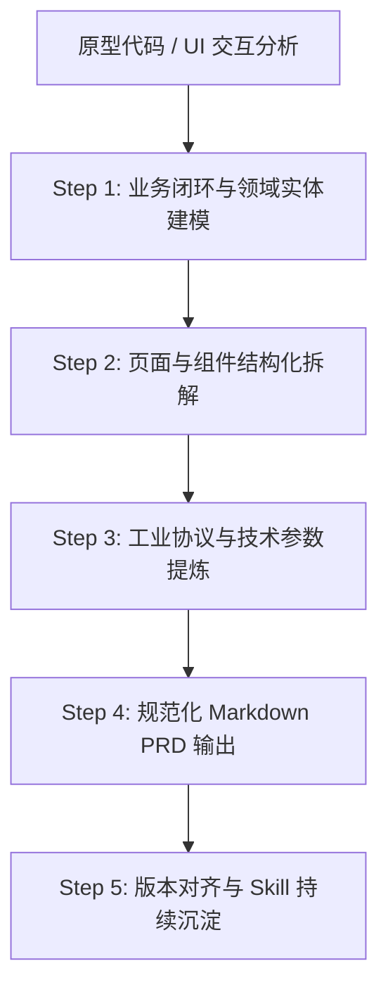

# 从原型到需求规格说明书（Prototype-to-PRD）实战方法论

本技能总结自 **XLab 2D 物联网虚拟仿真系统（从 V1 到 V5.2.0 首发基线版）** 从 0 到 1 的完整产品化与规格说明书编写经验。旨在建立一套**高保真、可复用、结构严谨、面向 AI 智能体与工程研发落地**的原型逆向提取与需求文档编写标准，并在每一次需求迭代中持续进化。

---

## 1. 核心工作流程（5步工作法）



### Step 1: 业务闭环与领域实体建模（Domain Modeling）
- **抓取全局路由与页面状态**：从路由入口（如 `App.tsx`、`routes`）识别系统核心页面（首页、设计器、控制台、详情大屏、智能体）；
- **梳理核心数据实体（Entities）**：识别系统底层的核心模型（如系统设备库、自定义设备、仿真工程、物料素材、拓扑节点、拓扑连线、遥测数据、反向控制状态）；
- **绘制业务全景流转链路**：明确正向主链路（物料选型 -> 拓扑设计 -> 仿真验证 -> 监控发布）、逆向分支（撤销重做、克隆副本、下架删除）与异常拦截（冲突告警、非法连线拦截）。

### Step 2: 页面与组件结构化拆解（Screen-to-Spec Mapping）
针对原型中的每一个功能视窗或组件模块，按照以下标准化维度进行“地毯式”拆解：

1. **多维筛选与关键词搜索栏**：
   - 必须输出**【筛选项定义表】**（筛选条件、控件类型、选项值/输入规则、默认值、校验与限制）；
   - 明确多筛选项之间的逻辑关系（通常为 `AND` 关系）与一键清空/重置筛选交互规则。
2. **多层级分类导航树**：
   - 明确层级深度（一级大类 -> 二级子类 -> 三级叶子节点）；
   - 说明全局控制项（【展开全部】/【折叠全部】）的递归逻辑；
   - 标明各分类行右侧的**数量统计徽标（Badge）**及其展开高亮联动效果。
3. **列表/卡片/双模视图（Grid vs List）**：
   - 必须输出**【列表展示字段表】**（字段名称、展示形式、业务说明）；
   - 明确双模视图（方块宫格 Grid vs 紧凑列表 List）的排布规格、展示侧重点（宫格注重直观图文、列表注重型号与 ID 参数）；
   - 明确排序规则（最新发布、最多浏览）、分页与缺省空态（Empty State）引导。
4. **分步向导弹窗与模态对话框（Wizard / Modal）**：
   - 明确自适应分步逻辑（如根据设备类型动态适配 3~5 步）；
   - 明确每一阶段的表单项、控件类型、必填性、字符限制、范围步进值、默认回填值；
   - 明确防误触关闭确认与“上一步”草稿保留机制。
5. **复杂画布与拓扑工作区（Canvas / Workspace）**：
   - 明确视口缩放极值边界（如 `25% ~ 200%`）、对齐与网格吸附步长；
   - 明确连线规则：锚点吸附、介质标注、自环拦截与重复连线阻断；
   - 明确**双重添加模式**：鼠标悬浮快捷添加（`Hover + Add` 阶梯自动偏移）与 HTML5 原生拖拽（`Drag & Drop` 精确落点）。
6. **AI 智能助手/智能体（Agent Widget）**：
   - 交互形态：右下角悬浮气泡、抽屉视窗、居中沉浸大窗、多模态附件上传（图片/文档）；
   - 核心能力：自然语言设备建模、素材库语义搜图、端到端工程生成、拓扑合规排障与协议字节拆解。

### Step 3: 工业协议与技术参数提炼（Protocol & Technical Specs）
针对工控、物联网或特定技术领域的原型，必须下沉到数据链路层：
- **Modbus 寄存器映射表**：明确属性名、功能码（`0x01/0x03/0x04/0x05/0x06`）、起始地址（Hex/Dec）、数据长度（Words/Bits）、换算公式（`RAW / 10.0`）、物理单位与量程；
- **模拟量（Analog）转换公式**：明确 0~5V/4~20mA 信号范围与实际物理量转换模型及 ADC 采样映射；
- **设备素材防删保护**：存在拓扑或工程引用时禁止物理删除，保障资产一致性；
- **状态机与防连击保护**：执行器指令下发时的 Loading 锁定与状态防抖翻转。

### Step 4: 规范化 Markdown PRD 输出（AI-Optimized Markdown Formatting）
为了让需求文档兼具**极佳的人类可读性**与**极高的 AI 上下文解析准确度**，必须严格遵循以下排版规范：
- **严禁使用悬空断行**：表格必须与前后的文本之间留有空行（`\n\n`）；
- **表格列对齐统一**：表头加粗，对齐符统一使用 `:---`（靠左对齐）；
- **列表格式统一**：无序列表使用 `- **属性名称**：详细说明`，有序操作流程使用 `1. `, `2. `, `3. `；
- **纯净文本无图原则（面向 AI）**：剥离界面截图引用（`images/...`），用详尽的结构化字段与状态机代替图片，避免多模态 token 浪费与图片丢失失效；
- **文档完整性要素**：包含文档属性表、目录（TOC）、需求背景、名词术语表、功能规格、非功能需求（FPS/响应时效/兼容性）、测试边界与验收基线、本地缓存隔离等运维规范。

### Step 5: 版本对齐与 Skill 持续沉淀（Iterative Skill Refinement）
- **版本基线对齐**：当用户提供手动批注版或新版 `.docx` 时，先提取核心差异（如本期 5.2.0 对 5.3.1 全部应用发布勾选、5.4.1 发布弹窗、5.4.2 展开折叠、5.5 复制项目与 BOM 单设备复制、5.6 AI 搜图等调整），再精准落地到 Markdown PRD；
- **反哺经验库**：每次补充新的交互特征（如“设备从机地址唯一性校验”、“素材库语义搜图”），均同步更新本技能的检查清单（Checklist）。

---

## 2. 原型逆向提取标准检查清单（Checklist）

在编写或审查每一份 PRD 时，逐项对照以下清单，确保零遗漏：

| 模块类别 | 核心检查点 | 常见遗漏盲区（需重点补充） |
| :--- | :--- | :--- |
| **基础信息** | 文档版本、生效时间、原型对应路由 | 历史版本演进记录、脱敏规则 |
| **筛选项** | 控件类型、候选值、默认值、校验限制 | 筛选项之间的逻辑关系（AND）、一键重置与清空逻辑 |
| **导航树** | 层级深度、展开/折叠动画、激活样式 | **展开全部/折叠全部**、各层级右侧**设备数量徽标（Badge）** |
| **数据列表** | 字段名称、展示形式、数据格式 | **宫格视图（Grid）与列表视图（List）的区别说明**、缺省空态 |
| **操作交互** | 点击、悬浮、拖拽、弹窗触发 | **鼠标悬浮快捷添加（Hover + Add）**、**HTML5 拖拽落点实例化** |
| **协议与硬件** | 通信协议标签、供电规格、电气引脚 | **全视图协议彩色胶囊标注**、Modbus 寄存器表、模拟量量程公式 |
| **工程/物料克隆** | 复制按钮触发、模态弹窗表单、默认命名规则 | **`${原名称} 副本` 命名回填**、深拷贝拓扑连线与参数逻辑 |
| **BOM 设备清单** | 硬件图、名称、类型、协议、使用台数 | **清单内单设备一键克隆为私有自定义设备功能** |
| **AI 智能助手** | 视窗形态、大窗切换、多模态图文输入 | **素材库语义自动搜图**、自然语言设备建模、端到端项目生成 |
| **非功能指标** | 画布 FPS、查询过滤时延、首屏加载时间 | 浏览器兼容版本、屏幕分辨率自适应、异常拦截与本地缓存隔离 |

---

## 3. 标准需求文档结构模板（PRD Template）

```markdown
# 【版本号】系统名称 用户需求规格说明书

| 文档属性 | 详细信息 |
| :--- | :--- |
| **文档名称** | 【版本号】系统名称 |
| **原型地址** | 相关路由或原型系统链接 |
| **文档版本** | V1.0.0 (基线版) |
| **编写人** | 姓名 / 团队 |
| **审核人** | 审核人姓名 |
| **生效日期** | YYYY-MM-DD |

---

## 目录
- [1. 需求背景与产品定位](#1-需求背景与产品定位)
- [2. 名词定义与缩略语](#2-名词定义与缩略语)
- [3. 业务流程与系统架构](#3-业务流程与系统架构)
- [4. 平台整体界面布局与 UI 设计规范](#4-平台整体界面布局与-ui-设计规范)
- [5. 功能需求说明](#5-功能需求说明)
  - [5.1 模块一](#51-模块一)
  - [5.2 模块二](#52-模块二)
- [6. 非功能需求](#6-非功能需求)
- [7. 测试关注点与验收基线](#7-测试关注点与验收基线)
- [8. 其他注意事项](#8-其他注意事项)

---

## 1. 需求背景与产品定位
...

## 2. 名词定义与缩略语
| 名词 / 术语 | 英文 / 缩写 | 定义与技术说明 |
| :--- | :--- | :--- |
...

## 5. 功能需求说明
### 5.x 模块名称
#### 5.x.1 筛选与搜索
1. **筛选项定义表**：
| 筛选条件 | 控件类型 | 选项值 / 输入规则 | 默认值 | 校验与限制 |
| :--- | :--- | :--- | :--- | :--- |
...
2. **条件逻辑与重置**：
...

#### 5.x.2 列表与视图
1. **列表展示字段**：
| 字段名称 | 展示形式 | 说明 |
| :--- | :--- | :--- |
...
2. **视图切换与操作项**：
- **方块宫格视图（Grid View）**：...
- **紧凑列表视图（List View）**：...
- **交互方式**：
  - **鼠标悬浮快捷添加（Hover + Add）**：...
  - **HTML5 原生拖拽（Drag & Drop）**：...

---

## 6. 非功能需求
1. **性能指标**：...
2. **兼容性**：...

## 7. 测试关注点与验收基线
| 测试模块 | 关注重点与边界场景 | 预期表现基线 |
| :--- | :--- | :--- |
...

## 8. 其他注意事项
...
```

---

## 4. 技能演进与维护准则
1. **每次迭代更新**：当原型系统增加新组件（如 3D 拓扑、数字孪生协议、新图表引擎）时，将新增的拆解模式与字段表规范补充到本 Skill 的第 2 节（检查清单）与第 3 节（模板）；
2. **持续保持纯净**：始终坚持纯文本与标准 Markdown 格式，杜绝任何外部未定义宏或破损图片标签，确保 AI 与工程师均可无缝读取并高效实现。
