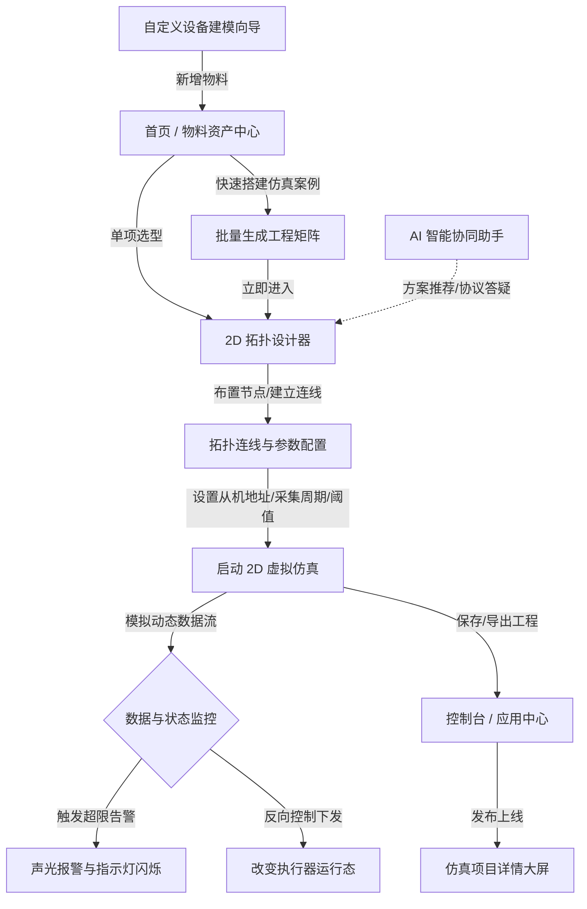
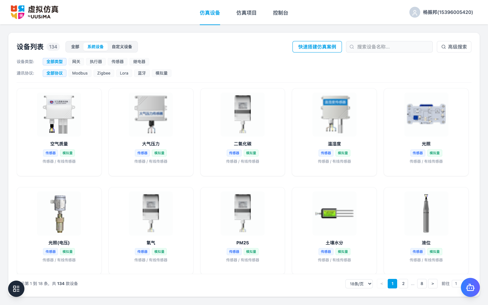
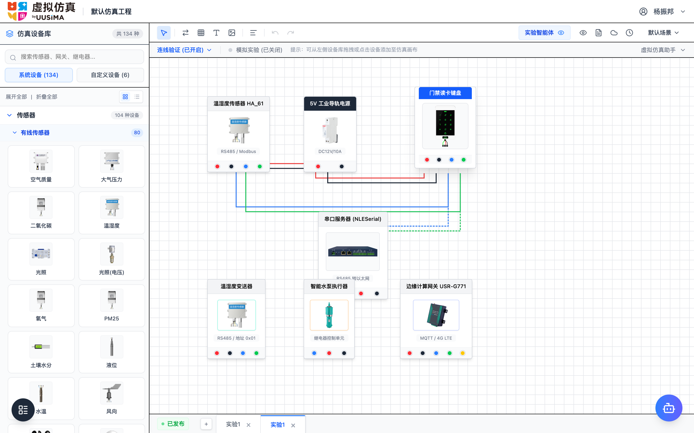
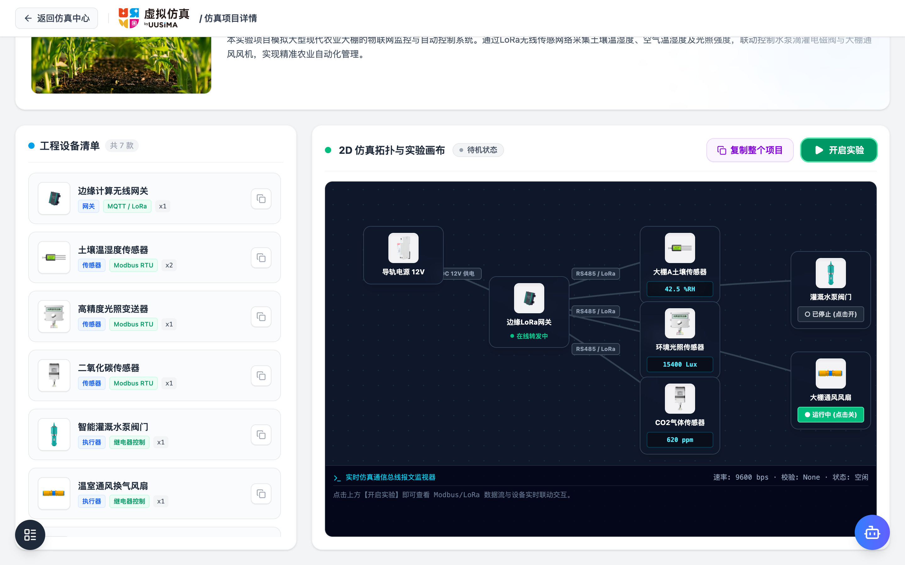

# XLab 2D 物联网虚拟仿真平台 用户需求规格说明书

| 文档属性 | 详细信息 |
| :--- | :--- |
| **文档名称** | XLab 2D 物联网虚拟仿真平台 用户需求规格说明书 |
| **项目名称** | XLab (Next-Gen IoT 2D Virtual Simulation Platform) |
| **文档版本** | V1.0.0 (基线版) |
| **编写人** | AI 产品架构团队 / Antigravity |
| **审核人** | 研发与测试项目组 |
| **生效日期** | 2026-08-20 |
| **文档状态** | [x] 正式发布 &nbsp;&nbsp; [ ] 评审中 &nbsp;&nbsp; [ ] 草稿 |

---

## 目录 (Table of Contents)

- [1. 需求背景与产品定位](#1-需求背景与产品定位)
  - [1.1 行业与教学实训痛点](#11-行业与教学实训痛点)
  - [1.2 产品定位与核心价值](#12-产品定位与核心价值)
  - [1.3 适用用户角色与使用场景](#13-适用用户角色与使用场景)
- [2. 名词定义与缩略语](#2-名词定义与缩略语)
- [3. 业务流程与系统架构](#3-业务流程与系统架构)
  - [3.1 全局业务流转链路](#31-全局业务流转链路)
  - [3.2 核心业务流程闭环](#32-核心业务流程闭环)
- [4. 平台整体界面布局与 UI 设计规范](#4-平台整体界面布局与-ui-设计规范)
  - [4.1 品牌与 UI 视觉设计规范（呼应 LOGO）](#41-品牌与-ui-视觉设计规范呼应-logo)
  - [4.2 顶部全局导航栏（Header）](#42-顶部全局导航栏header)
  - [4.3 全局路由与页面划分](#43-全局路由与页面划分)
- [5. 功能需求说明](#5-功能需求说明)
  - [5.1 仿真设备](#51-仿真设备)
    - [5.1.1 搜索与筛选项](#511-搜索与筛选项)
    - [5.1.2 设备分类导航树](#512-设备分类导航树)
    - [5.1.3 设备列表](#513-设备列表)
    - [5.1.4 设备详情弹窗](#514-设备详情弹窗)
    - [5.1.5 快速搭建仿真案例](#515-快速搭建仿真案例)
  - [5.2 仿真项目](#52-仿真项目)
    - [5.2.1 搜索与行业筛选项](#521-搜索与行业筛选项)
    - [5.2.2 仿真项目列表](#522-仿真项目列表)
  - [5.3 控制台](#53-控制台)
    - [5.3.1 全部应用](#531-全部应用)
    - [5.3.2 自定义设备](#532-自定义设备)
    - [5.3.3 设备素材管理](#533-设备素材管理)
  - [5.4 拓扑设计器](#54-拓扑设计器)
    - [5.4.1 顶部工具栏](#541-顶部工具栏)
    - [5.4.2 左侧物料库面板](#542-左侧物料库面板)
    - [5.4.3 2D 画布工作区](#543-2d-画布工作区)
    - [5.4.4 节点属性配置面板](#544-节点属性配置面板)
  - [5.5 仿真项目详情](#55-仿真项目详情)
    - [5.5.1 项目概览与元数据信息](#551-项目概览与元数据信息)
    - [5.5.2 工程设备清单与单设备复制](#552-工程设备清单与单设备复制)
    - [5.5.3 拓扑实验看板与复制整个项目](#553-拓扑实验看板与复制整个项目)
  - [5.6 AI 智能助手](#56-ai-智能助手)
    - [5.6.1 悬浮与大窗交互视窗](#561-悬浮与大窗交互视窗)
    - [5.6.2 智能助手核心能力范围](#562-智能助手核心能力范围)
- [6. 非功能需求](#6-非功能需求)
  - [6.1 性能与渲染指标](#61-性能与渲染指标)
  - [6.2 终端与浏览器兼容性](#62-终端与浏览器兼容性)
  - [6.3 交互与反馈时效规范](#63-交互与反馈时效规范)
  - [6.4 安全性与异常容错兜底](#64-安全性与异常容错兜底)
- [7. 测试关注点与验收基线](#7-测试关注点与验收基线)
  - [7.1 功能测试关注重点与边界场景](#71-功能测试关注重点与边界场景)
  - [7.2 交互禁忌红线清单](#72-交互禁忌红线清单)
- [8. 其他注意事项](#8-其他注意事项)
  - [8.1 本地存储隔离与数据清洗](#81-本地存储隔离与数据清洗)
  - [8.2 设备资产映射自动化维护机制](#82-设备资产映射自动化维护机制)

---

## 1. 需求背景与产品定位

### 1.1 行业与教学实训痛点
在物联网（IoT）、智能制造、智慧农业、智能楼宇与工控自动化领域，系统集成与方案验证通常面临以下核心困境：
1. **硬件成本高与损耗大**：实体传感器、PLC、网关和执行器设备单价高，教学实训和方案推演中频繁接线易导致设备烧毁或短路损耗。
2. **环境部署周期长**：物理搭建大棚、隧道、水质监测站等场景周期长、场地受限，无法随时进行多拓扑组合验证。
3. **协议调试门槛高**：Modbus RTU/TCP、ZigBee、LoRa 等工业通信协议涉及复杂的寄存器地址换算、字节序处理和校验码计算，缺乏直观的可视化调试与仿真环境。
4. **预演与真实落地脱节**：传统组态软件庞大臃肿，轻量级教学方案又缺乏真实的工业设备物料库和电气逻辑支撑。

### 1.2 产品定位与核心价值
**XLab 2D 物联网虚拟仿真平台** 是一款面向物联网、工控自动化与智慧行业场景的**现代化、高保真、轻量级 2D 拓扑设计与虚拟仿真系统**。
- **高保真工业物料库**：内置 220+ 款工业级传感器、执行器、PLC 与网关物料，支持多电压供电、通信协议与寄存器帧定义。
- **直观拖拽仿真画布**：支持图形化拖拽构建拓扑连线，实时模拟传感器数值波动、链路数据流动画与执行器反向控制。
- **快速案例搭建向导**：支持在首页勾选设备与数量，一键矩阵化自动生成并导入设计器，极大降低拓扑搭建门槛。
- **全流程自定义设备建模**：提供分步向导，支持用户扩展专有设备物料及 Modbus 寄存器映射。
- **AI 智能协同中枢**：集成大语言模型，提供场景方案推荐、拓扑搭建指导及 Modbus 协议排障辅助。

### 1.3 适用用户角色与使用场景
| 用户角色 | 核心使用场景 | 核心诉求与价值 |
| :--- | :--- | :--- |
| **高校/职校实训学员** | 物联网传感器接线实训、Modbus 协议解析实验、智能控制逻辑联调 | 零硬件损耗、可视化数据流、即时掌握电气与协议规则 |
| **教研教师/课程导师** | 课件案例演示、实验拓扑模板设计、学生仿真作业下发与评审 | 快速加载预置行业模板（智慧农业/家居/交通），标准化授课 |
| **物联网方案工程师** | 售前方案拓扑设计、客户需求快速原型推演、物料清单（BOM）预估 | 毫秒级检索物料、快速导出高清拓扑快照与物料配置表 |

---

## 2. 名词定义与缩略语

| 名词 / 术语 | 英文 / 缩写 | 定义与技术说明 |
| :--- | :--- | :--- |
| **仿真画布** | Simulation Canvas | 用户进行 2D 物联网节点布局、拓扑连线绘制与动态数据流模拟的核心可视工作区。 |
| **设备节点** | Device Node | 画布中实例化的设备实体，包含节点唯一标识（NodeId）、别名、通信地址、工作状态与遥测数值。 |
| **拓扑连线** | Topology Link | 表达设备节点间物理或逻辑通信链路的连线，支持 RS485 总线、以太网（RJ45）、无线通信（LoRa/ZigBee/Wi-Fi）等介质。 |
| **Modbus 协议** | Modbus RTU/TCP | 工业领域事实标准的通信协议。RTU 采用串口十六进制传输；TCP 运行在以太网之上。 |
| **从机地址** | Slave ID | Modbus 串行总线中设备的唯一物理标识，通常取值范围为 `1 ~ 247`。 |
| **功能码** | Function Code | Modbus 报文指令类型（如 `0x03` 读保持寄存器、`0x06` 写单寄存器、`0x05` 写单线圈等）。 |
| **寄存器映射** | Register Map | 将传感器物理测量量（如温度、光照）或控制开关映射到特定寄存器地址、数据类型及比例系数的规则表。 |
| **遥测数据** | Telemetry Data | 设备节点在仿真运行态下周期性产生的测量数值（如温湿度、水质 pH、电压），支持正弦或随机波动。 |
| **反向控制** | Reverse Actuation | 用户或联动策略向执行器节点（如风机、水泵、继电器）下发写入指令，改变设备运行状态的行为。 |

---

## 3. 业务流程与系统架构

### 3.1 全局业务流转链路
平台的整体业务运作链路包含物料选型/快速搭建、拓扑设计、属性配置、仿真验证、工程运行监控及自定义扩展五大闭环环节：

### 3.2 核心业务流程闭环
1. **正向主链路（设备选型/快速搭建 -> 拓扑设计 -> 仿真运行 -> 项目详情监控）**：
   - 用户在首页选择设备或在快速搭建栏勾选多款物料 -> 一键生成案例进入设计器 -> 画布自动完成矩阵式排布 -> 建立通信连线并配置从机地址等参数 -> 点击启动仿真观察动态数据流与告警 -> 保存工程并在控制台发布至项目详情大屏。
2. **逆向分支链路（撤销回滚 / 工程克隆 / 物料下架）**：
   - 画布编辑支持 `Ctrl+Z` 逐步回退操作；控制台支持克隆历史工程进行二次开发；自定义物料支持下架或软删除，但受引用关系保护。
3. **异常分支链路（断网容错 / 冲突拦截 / 仿真容错）**：
   - 连线遇到同节点自环或不兼容介质时实时拦截并弹出悬浮气泡；从机地址冲突时在属性面板实时红字提示并阻止启动仿真。

---

## 4. 平台整体界面布局与 UI 设计规范

### 4.1 品牌与 UI 视觉设计规范（呼应 LOGO）
为了保证系统整体视觉风格的高品质与专业度，平台视觉规范深度呼应系统 Logo（UUSIMA 工业互联青蓝标识），构建了清晰统一的工控 SaaS 视觉语言。

#### 4.1.1 品牌色彩体系
| 颜色类别 | 色值 (HEX) | 适用场景与交互规范 |
| :--- | :--- | :--- |
| **品牌主色 (SkyBlue)** | `#00A0E9` | Logo 标准色、主导航激活指示条、输入框聚焦高亮描边 |
| **工业深蓝 (DeepBlue)** | `#2563EB` / `#1D4ED8` | 核心主操作按钮、选中高亮背景、重要分类标签 |
| **成功运行绿 (Emerald)** | `#10B981` | 仿真运行中呼吸灯、设备在线状态、执行器开启态 |
| **待机预警橙 (Amber)** | `#F59E0B` | 接近告警阈值、通信等待响应、待定提示 |
| **故障危险红 (Rose)** | `#EF4444` | 超限告警红框呼吸灯、设备离线状态、高危删除二次确认 |
| **背景中性灰 (Gray)** | `#F0F2F5` / `#F8FAFC` | 全局页面背景底色、工具栏分割线、禁用控件底色 |
| **纯白卡片 (White)** | `#FFFFFF` | 内容卡片底色、模态弹窗容器、抽屉面板工作区 |

#### 4.1.2 字体与排版层级
- **字体栈**：优先使用系统标准无衬线字体栈 `system-ui, -apple-system, BlinkMacSystemFont, 'Segoe UI', Roboto, 'PingFang SC', 'Microsoft YaHei', sans-serif`；代码与报文解析使用等宽字体 `ui-monospace, SFMono-Regular, Menlo, Monaco, Consolas, monospace`。
- **字号与层级规范**：
  - 一级标题（页面大标题/大弹窗标题）：`18px / 20px`，字重 `600 (Semibold)`；
  - 二级标题（模块分组标题/卡片名称）：`15px / 16px`，字重 `500 / 600`；
  - 正文内容（属性标签/表单文本/描述）：`13px / 14px`，字重 `400 (Regular)`；
  - 辅助/标签/时间戳（微小提示文本）：`11px / 12px`，字重 `400`，字色 `#6B7280`。

#### 4.1.3 控件与质感规范
- **圆角规范**：
  - 小按钮与输入框：`rounded-md` (6px) 或 `rounded-lg` (8px)；
  - 内容卡片与面板：`rounded-xl` (12px)；
  - 模态弹窗与大容器：`rounded-2xl` (16px)；
  - 状态胶囊标牌与浮动按钮：`rounded-full` (9999px)。
- **质感与投影**：
  - 卡片常态采用极细边框 `border border-gray-200/80`，悬浮时叠加轻微微拟物投影 `shadow-md hover:-translate-y-0.5 transition-all`；
  - 弹窗与遮罩层采用毛玻璃模糊滤镜 `backdrop-blur-sm bg-black/40`。

### 4.2 顶部全局导航栏（Header）
- **左侧品牌 Logo 区**：展示系统 Logo 图片与品牌标识，支持点击平滑返回首页。
- **居中主导航 Tab**：包含【仿真设备】、【仿真项目】、【控制台】三大入口，当前激活项下方展示青蓝色（`#00A0E9`）高亮下划线。
- **右侧个人中心区**：展示当前登录用户头像、用户昵称（如“杨振邦”）及下拉操作箭头。

### 4.3 全局路由与页面划分
- `/`：首页（集成仿真设备资产库与公共仿真项目案例展示）；
- `/console`：控制台（集成全部应用管理、自定义设备管理、设备素材管理）；
- `/design`：2D 虚拟仿真拓扑设计器（核心设计工作画布）；
- `/project/:id`：仿真项目详情（项目概览、拓扑运行看板与控制面板）。

---

## 5. 功能需求说明

### 5.1 仿真设备

> **模块界面截图：**
> 
> 
> 
> 

#### 5.1.1 搜索与筛选项
1. **筛选项定义表**：
| 筛选条件 | 控件类型 | 选项值 / 输入规则 | 默认值 | 校验与限制 |
| :--- | :--- | :--- | :--- | :--- |
| **设备搜索** | 文本输入框 | 支持输入设备中文名、英文型号（ID）、所属分类关键字 | 空 | 限制 ≤50 字符，支持输入清空（`X`） |
| **通信协议** | 单选标签组 | 【全部协议】、【Modbus】、【Zigbee】、【Lora】、【蓝牙】、【模拟量】 | 全部协议 | 单选，点击即时触发列表过滤 |
| **设备类型** | 单选标签组 | 【全部类型】、【传感器】、【执行器】、【网关】、【继电器】 | 全部类型 | 单选，点击即时触发列表过滤 |
| **物料来源** | 下拉选择框 | 【全部来源】、【系统物料】、【自定义物料】 | 系统物料 | 下拉单选 |

2. **条件逻辑关系与重置规则**：
- **逻辑关系**：所有筛选项之间均为 **AND（且）** 关系，列表仅展示同时满足关键字匹配、通信协议、设备类型及物料来源的设备数据。
- **输入清空与重置**：搜索框右侧提供一键清空按钮；若筛选结果为空，设备列表居中显示“暂无匹配设备”空态提示，并提供“重置筛选”按钮，点击后一键恢复全部筛选项的默认值。

#### 5.1.2 设备分类导航树
- **功能说明**：以树状多层级目录展示设备物料的分类归属（根节点 -> 一级分类如“传感器面板”、“采集器面板” -> 二级分类如“有线传感器”、“无线传感器” -> 三级具体分类）。
- **操作规则**：
  - 点击父级节点展开/折叠子树，展开动画时效 `200ms`；
  - 点击任意分类节点，右侧设备列表联动刷新，过滤出属于该分类及其子分类下的全部设备；
  - 选中节点高亮显示（浅蓝底色与青蓝字色），并在右侧展示当前分类下的设备总数徽标（Badge）。

#### 5.1.3 设备列表
1. **列表展示字段**：

| 字段名称 | 展示形式 | 说明 |
| :--- | :--- | :--- |
| **设备缩略图** | 图片卡片 | 设备高清外观图，支持懒加载；若图片加载 404 自动回退至默认占位图 |
| **设备名称** | 文本标题 | 设备的中文名称（如：二氧化碳传感器） |
| **设备型号** | 文本标识 | 设备的唯一型号编码（如：`RS485_CO2`） |
| **通信协议** | 胶囊标签 | 标注设备通信协议（如 `Modbus`、`Zigbee`） |
| **设备类型** | 胶囊标签 | 标注设备大类（如 `传感器`、`执行器`、`网关`） |
| **分类路径** | 辅助文本 | 设备所属的完整分类层级面包屑路径 |

2. **列表规则与操作**：
- **布局模式**：网格卡片排列，自适应屏幕宽度（大屏 4 列、中屏 3 列、小屏 2 列）；
- **操作项**：鼠标悬浮卡片轻微上浮，单击任意卡片打开【设备详情弹窗】；
- **分页规则**：底部提供分页控件，展示总数（220+）、当前页码、上一页/下一页按钮及页码快速跳转输入框；
- **空态展示**：无匹配设备时居中展示友好空态提示与插画。

#### 5.1.4 设备详情弹窗
- **功能说明**：在首页点击设备卡片，以大尺寸模态弹窗（宽度为 `max-w-5xl`，自适应高度并支持内部滚动）展示该设备的完整技术规格、协议细节与通信指令规范。
- **展示规则与 Tab 切换机制**：
  1. **Tab 选项卡机制**：
     - **Modbus / 模拟量设备**：弹窗右上角提供 **【基础信息】** 与 **【协议信息】** 两个 Tab 切换按钮；**默认展示【基础信息】**，点击【协议信息】时才展开 Modbus 寄存器表/指令报文或模拟量转换公式。
     - **Zigbee / 其他无线设备**：仅展示【基础信息】，不展示【协议信息】Tab 及相关协议数据包报文，界面保持轻简。
  2. **【基础信息】Tab 展示内容**：
     - **视觉预览**：设备高清实物渲染/自定义贴图、所属分类层级；
     - **电气特性与接口**：工作电压（如 `DC 12V / 24V 工业级`）、电气引脚接线定义（Modbus 为 `VCC`、`GND`、`RS485-A/B`；模拟量为 `VS`、`GND`、`SIGNAL`）；
     - **资产归属**：若是自定义设备，展示创建人脱敏名称（如 `杨*邦`）与创建时间；提供「添加到案例清单」与「复制此自定义设备」快捷操作。
  3. **【协议信息】Tab 展示内容（Modbus / 模拟量专属）**：
     - **Modbus 协议设备专属**：
       - **Modbus 寄存器属性映射表**：属性名称、功能码 (0x01/0x03/0x04/0x05/0x06)、起始地址 (Hex/Dec)、长度/数据类型 (Int16/UInt16/Bit)、物理量换算公式（如 `Real_Temp = RAW / 10.0`）、单位/量程及说明；
       - **Modbus 采集与控制指令示例**：十六进制报文（支持一键复制）与结构化逐字节色块拆解标注（从机地址、功能码、起始地址、寄存器数、CRC16校验码），以及应答帧与最终物理量计算结果。
     - **模拟量 (Analog) 协议设备专属**：
       - **信号规格**：`4 ~ 20 mA 电流型` 或 `0 ~ 5V / 0 ~ 10V 电压型` 及对应物理标定量程；
       - **线性换算标准公式**：标准数学公式高亮卡片；
       - **实例分步推导计算**：采样输入值（如 $I = 12.0\text{ mA}$ 或 $V = 2.5\text{ V}$）的三步分步推导演算步骤及最终物理量输出结果；
       - **ADC 通道对应关系**：12 位工业 ADC 芯片（0~4095 对应 0~Vref）的线性关系说明。
- **操作项**：支持点击右上角关闭按钮、遮罩空白处或按键盘 `Esc` 键关闭弹窗。

#### 5.1.5 快速搭建仿真案例
- **功能说明**：提供在首页勾选多款设备并一键生成 2D 拓扑工程的功能，降低拓扑搭建门槛。
- **操作流程与表单规则**：
  1. **开启模式**：点击首页顶部“快速搭建仿真案例”开关进入构建模式，设备卡片上显现“+ 添加到案例”按钮与数量步进器（范围 1~99）；
  2. **案例构建工作栏表单**：
     | 字段名称 | 控件类型 | 必填性 | 校验与限制 | 默认值 / 说明 |
     | :--- | :--- | :--- | :--- | :--- |
     | **案例名称** | 文本输入框 | 必填 | 限制 1~30 字符，非空 | 默认为“自建仿真工程” |
     | **已选设备清单** | 分类分组列表 | 必填 | 至少包含 1 件物料 | 按设备类型（传感器、执行器、继电器、网关等）分组展示，清晰呈现设备缩略图、名称、通信协议徽标（如 Modbus、模拟量、Zigbee）与台数步进器，支持数量增减与单项移除 |
     | **物料总数统计** | 徽标与文本 | - | 自动汇总已选设备款数与总台数 | 实时计算展示（如“共 3 款 / 5 台”） |
  3. **生成进度弹窗**：点击“一键生成案例”，弹出进度弹窗（依次流转：创建工程容器 -> 注入物料模型 -> 案例生成完成）；
  4. **导入设计器**：进度完成后点击“立即进入设计器”，系统跳转至 `/design`，并将所选设备在画布上以 4 列矩阵网格自动排列整齐。

---

### 5.2 仿真项目

> **模块界面截图：**
> 
> （在首页顶部主导航切换至【仿真项目】Tab）

#### 5.2.1 搜索与行业筛选项
1. **筛选项定义表**：
| 筛选条件 | 控件类型 | 选项值 / 输入规则 | 默认值 | 校验与限制 |
| :--- | :--- | :--- | :--- | :--- |
| **项目搜索** | 文本输入框 | 支持按项目名称模糊搜索 | 空 | 限制 ≤50 字符，支持输入清空 |
| **行业分类** | 单选标签组 | 【全部】、【智慧农业】、【智慧家居】、【智慧交通】、【智慧安防】 | 全部 | 单选，点击即时触发过滤 |

2. **条件逻辑关系**：搜索关键字与行业分类之间为 **AND（且）** 关系。

#### 5.2.2 仿真项目列表
1. **列表展示字段**：

| 字段名称 | 展示形式 | 说明 |
| :--- | :--- | :--- |
| **项目封面图** | 场景图片 | 项目高清效果缩略图 |
| **项目名称** | 文本标题 | 仿真项目的中文名称（如：基于LoRa的智慧农场环境监控系统） |
| **行业标签** | 胶囊标签 | 项目所属行业领域（如 `智慧农业` 绿色标签） |
| **应用类型** | 胶囊标签 | 项目发布级别（`系统应用` 蓝色标牌 / `个人应用` 灰色标牌） |
| **发布人** | 辅助文本 | 项目创建或发布人姓名（如 `杨**`） |
| **发布时间** | 辅助文本 | 项目创建/发布时间（格式：`YYYY-MM-DD HH:mm:ss`） |
| **浏览热度** | 辅助文本 | 历史浏览次数（如 `1250 次浏览`） |

2. **操作与跳转**：
- **卡片悬浮动效**：鼠标悬浮卡片呈现上浮微动画与卡片阴影加深；
- **进入项目详情**：单击卡片任意主体区域，路由跳转至该项目的【仿真项目详情页】（`/project/:id`）；
- **新窗口预览**：卡片右下角提供「预览项目详情」按钮（图标：Eye），点击在新标签页打开项目详情；
- **复制项目操作**：卡片右下角提供「复制项目」快捷按钮（图标：Copy），支持一键克隆该项目至个人空间。

3. **复制项目功能规则与弹窗流程**：
- **触发与弹窗**：点击项目卡片上的「复制项目」按钮，弹出【复制项目】模态对话框；
- **默认命名规则**：输入框自动回填默认名称 `${原项目名称} 副本`（如：`智慧农业环境监控仿真系统 副本`），并自动聚焦输入框；
- **表单输入限制**：
  | 表单项 | 控件类型 | 必填性 | 校验规则 | 说明 |
  | :--- | :--- | :--- | :--- | :--- |
  | **新项目名称** | 文本输入框 | 必填 | 1~50 字符，去首尾空格后非空 | 用户可自定义修改复制后的副本名称 |
- **操作与结果**：
  - **取消**：点击「取消」或右上角关闭按钮，关闭弹窗且不产生副本；
  - **确认复制**：点击「确认复制」按钮，系统完整克隆该仿真工程的 2D 拓扑接线、物料清单与场景配置，将其作为新项目添加至当前用户的个人工作空间（控制台/全部应用），并弹出成功反馈消息；复制成功后用户可随时在控制台中进入设计器进行二次修改与实验。

---

### 5.3 控制台

> **模块界面截图：**
> 
> 
> 
> 

#### 5.3.1 全部应用
##### 5.3.1.1 搜索与视图切换
- **搜索输入框**：支持按项目名称或行业标签进行模糊搜索；
- **视图切换按钮**：提供【卡片网格视图】（Grid）与【表格视图】（Table）切换按钮，无刷新平滑切换。

##### 5.3.1.2 应用列表
1. **列表展示字段**：
- **网格视图**：展示项目缩略图、项目名称、发布状态标牌（已发布/草稿）、最后更新时间、行业标签；
- **表格视图**：展示项目 ID、项目名称、行业分类、发布状态、更新时间、操作栏。
2. **缺省空态**：当列表为空时，展示空态图标与“创建首个仿真应用”快捷操作。

##### 5.3.1.3 应用操作项
- **进入设计**：点击跳转至 2D 拓扑设计器并加载该项目拓扑；
- **监控大屏**：点击跳转至该项目的详情监控大屏（`/project/:id`）；
- **项目重命名**：支持修改项目名称（必填，限制 1~30 字符）；
- **克隆副本**：深拷贝当前工程数据，生成名为 `[原名称] 副本` 的新项目并插入列表首位；
- **删除项目**：弹出危险确认对话框（“确定要删除该项目工程吗？此操作无法恢复”），确认后彻底删除。

##### 5.3.1.4 新建应用
- 控制台顶部常驻“+ 新建”按钮，下拉选择【新建仿真应用】后，自动初始化空白工程并跳转至 2D 拓扑设计器。

---

#### 5.3.2 自定义设备
##### 5.3.2.1 筛选、搜索与视图切换
- **多维筛选器**：支持按「设备类型」（全部类型、传感器、执行器、网关、继电器）、「设备协议」（全部协议、Modbus RTU/TCP、Zigbee、MQTT、Lora、模拟量、其他）以及「发布状态」（全部状态、已发布至公共仿真大厅、未发布仅私有）进行快速下拉筛选；当存在筛选条件时提供一键「重置」功能；
- **关键词搜索**：支持输入设备名称、ID、型号等关键字进行实时模糊搜索；
- **双模视图切换**：支持卡片方块网格视图与标准表格列表视图无缝切换。

##### 5.3.2.2 自定义设备列表
1. **列表展示字段**：

| 字段名称 | 展示形式 | 说明 |
| :--- | :--- | :--- |
| **设备图标** | 图标/图片 | 自定义上传的外观缩略图 |
| **设备名称** | 文本标题 | 自定义设备的中文名称与唯一 ID |
| **设备类型** | 胶囊标签 | 传感器 / 执行器 / 网关 / 继电器 |
| **通信协议** | 胶囊标签 | Modbus RTU / Modbus TCP / Zigbee / Lora 等 |
| **供电规格** | 辅助文本 | 如 `DC 12V`、`AC 220V`、`无需供电` |
| **发布状态** | 状态徽章/开关 | 显示「已发布至仿真大厅」或「未发布 (私有)」，支持一键点击切换发布状态 |
| **创建时间** | 辅助文本 | 格式：`YYYY-MM-DD HH:mm` |

2. **视图与空态规则**：
- **卡片网格视图**：网格化展示各设备卡片，支持悬浮快捷操作、大图预览及发布状态徽标快速切换；
- **表格列表视图**：以清晰的数据表格列出各字段及操作项；
- **缺省空态**：当未搜索/筛选到设备，或尚未创建任何设备时，展示居中空态提示并提供清除筛选或快捷新建入口。

##### 5.3.2.3 自定义设备操作项
- **编辑设备**：打开向导弹窗回填当前数据进行修改；
- **查看详情**：打开设备参数详情弹窗，支持与仿真设备完全一致的「基础信息」与「协议信息」双选项卡：
  - **基础信息 Tab**：展示大图、设备分类、类型、协议、供电参数、发布状态、电气引脚定义，支持一键切换发布或复制设备；
  - **协议信息 Tab**：针对 Modbus 设备展示寄存器映射表（功能码、起始地址 HEX/DEC、换算公式、量程/单位）与 HEX 指令收发解析；针对模拟量设备展示换算公式卡、计算示例与 ADC 采样关系；
- **复制设备**：
  - **触发入口**：支持在自定义设备卡片快捷操作栏、表格列表行操作栏，以及设备详情弹窗内点击「复制」/「复制此自定义设备」按钮触发；
  - **操作流程与弹窗交互**：
    1. 点击后唤起「复制自定义设备」对话框；
    2. 弹窗内清晰展示原设备缩略图、原设备名称、所属类型与协议；
    3. 提供「新设备名称」输入框，默认自动回填 `[原设备名称] 副本`（必填，限制 1~30 字符）；
    4. 点击「确认复制」后，系统自动生成唯一设备 ID（`custom_[timestamp]`），完整深拷贝原设备的基础信息、电气供电参数、动作贴图、Modbus 寄存器表或模拟量量程配置，生成全新的独立设备并置顶插入自定义设备列表，同时弹出成功提示。
- **删除设备**：弹出二次确认提示，删除前自动校验工程引用关系（若该设备正在被现有工程拓扑引用，则弹出拦截警告并禁止删除）。

##### 5.3.2.4 新增自定义设备向导（AddCustomDeviceModal）
分步向导弹窗，步骤数依据设备类型动态自适应（执行器共 5 步，传感器共 4 步，网关共 3 步）：
- **步骤 1：基础信息定义**
  | 字段名称 | 控件类型 | 必填性 | 输入限制与校验规则 | 默认值 / 说明 |
  | :--- | :--- | :--- | :--- | :--- |
  | **设备名称** | 文本输入框 | 必填 | 限制 1~30 字符，非空 | - |
  | **设备图片** | 文件上传 / 图标选择 | 必填 | 支持 `.png`, `.jpg`, `.svg`，大小 `≤2MB` | 默认提供通用图标 |
  | **设备类型** | 单选按钮组 | 必填 | 【执行器】 / 【传感器】 / 【网关】 | 默认为【执行器】 |
  | **网关类型** | 单选按钮组 | 条件必填 | 若选择网关时出现：【云平台网关】 / 【边缘计算网关】 | 默认为【云平台网关】 |

- **步骤 2：供电与电气参数配置**
  | 字段名称 | 控件类型 | 必填性 | 输入限制与校验规则 | 默认值 / 说明 |
  | :--- | :--- | :--- | :--- | :--- |
  | **供电方式** | 单选按钮组 | 必填 | 【直流】 / 【交流】 / 【无需供电】 | 默认为【直流】 |
  | **交流电压** | 下拉选择 + 自定义输入 | 条件必填 | `220V` / `380V` / `自定义`；自定义限制 1~1000V 正整数 | 默认 `220V` |
  | **直流电压** | 下拉选择 + 自定义输入 | 条件必填 | `12V` / `24V` / `5V` / `自定义`；自定义限制 1~100V 正整数 | 默认 `12V` |

- **步骤 3：动作贴图 / 通信协议配置**
  - **执行器类型**：配置开启/运行状态贴图（`onImage`）与关闭/静止状态贴图（`offImage`），支持本地图片上传预览；
  - **传感器类型**：配置通信协议类型（单选：【ModbusRTU】 / 【模拟量采集】）；若选择模拟量采集，展开配置模拟量类型（电压/电流）、量程区间、物理单位与精度。

- **步骤 4：Modbus 寄存器属性映射（传感器专有）**
  - 动态表格支持增减行，每一行包含以下字段：
    | 表格列名 | 控件类型 | 必填性 | 输入限制与校验规则 | 示例值 |
    | :--- | :--- | :--- | :--- | :--- |
    | **参数名称** | 文本输入框 | 必填 | 限制 1~20 字符 | 温度 |
    | **物理单位** | 文本输入框 | 必填 | 限制 1~10 字符 | ℃ |
    | **测量量程** | 文本输入框 | 选填 | 格式如 `0-100` | 0-100 |
    | **功能码** | 下拉选择框 | 必填 | `0x03 读保持寄存器` / `0x04 读输入寄存器` | 0x03 |
    | **起始地址** | 文本输入框 | 必填 | 十六进制或十进制地址，地址不可冲突 | 0004 |
    | **数据长度** | 数字输入框 | 必填 | 正整数，单位 Words | 1 |
    | **换算公式** | 文本输入框 | 选填 | 支持公式语法，支持实时计算器验证 | R0=val/10 |

- **步骤 5：完成与发布**
  - **发布选项**：复选框（`publishToSimulation`），勾选后将设备发布至系统公开物料库；
  - **操作控制**：支持点击“上一步”自由回退修改，已填数据草稿保留不丢失；点击右上角关闭若有未保存修改则触发二次确认；点击“保存并创建”完成持久化写入。

---

#### 5.3.3 设备素材管理（DeviceMaterialManager）
##### 5.3.3.1 素材分类与标签导航
- **素材大类切换**：提供横向 Tab（【全部】、【传感器】、【执行器】、【控制器】、【网关】、【通信模块】等）；
- **常用标签筛选**：提供标签胶囊（如 `工业级`、`高精度`、`RS485`、`低功耗`、`Modbus` 等），支持多选组合过滤。

##### 5.3.3.2 素材搜索与列表展示
- **搜索框**：支持对素材名称、描述、关联标签进行综合模糊检索；
- **展示字段**：素材缩略图、素材名称、分类归属、标签集合、描述文本、引用次数；
- **分页控制**：支持切换页码、每页显示 10/20/50 条、输入页码直接跳转。

##### 5.3.3.3 素材操作与维护
- **新建素材表单弹窗**：
  | 字段名称 | 控件类型 | 必填性 | 输入限制与校验规则 |
  | :--- | :--- | :--- | :--- |
  | **素材名称** | 文本输入框 | 必填 | 限制 1~30 字符，非空 |
  | **所属分类** | 下拉选择框 | 必填 | 必选有效分类 |
  | **素材标签** | 标签输入控件 | 选填 | 支持回车快速生成标签胶囊，最多 5 个 |
  | **素材图片** | 文件上传 | 必填 | 支持 `.png`, `.jpg`, `.svg`，大小 `≤2MB` |
  | **功能描述** | 多行文本框 | 选填 | 限制 ≤200 字符 |
- **编辑/预览/删除**：支持在线修改素材信息、大图查看素材详情；删除素材时执行引用防删保护。

---

### 5.4 拓扑设计器

> **模块界面截图：**
> 
> 

#### 5.4.1 顶部工具栏
- **工程名称修改**：展示当前工程名称，支持点击行内编辑修改，失焦自动保存；
- **历史记录控制**：
  - 【撤销】（Undo）：快捷键 `Ctrl+Z / Cmd+Z`，回退至上一步画布快照；
  - 【重做】（Redo）：快捷键 `Ctrl+Y / Cmd+Shift+Z`，恢复撤销的操作；
  - 历史栈达到边界时按钮置灰禁用。
- **仿真控制按钮**：
  - 【启动仿真】：点击启动仿真循环时钟，按钮切换为【暂停】，顶部状态栏呈现“仿真运行中”绿色呼吸常亮指示灯；
  - 【重置仿真】：清空当前动态波动数据，所有节点数值恢复至出厂默认初始值。
- **视口缩放与对齐**：
  - 【缩小 `-`】 / 【放大 `+`】 / 缩放比例指示器（范围限制在 `25% ~ 200%`）；
  - 【100% 居中复位】：点击后画布平移恢复 `(0, 0)`，缩放比恢复 `100%`。
- **保存与快照导出**：
  - 【保存工程】：将当前拓扑配置写入持久化存储；
  - 【导出拓扑 JSON】：导出标准拓扑数据描述文件；
  - 【导出高清图片】：将当前画布可视区域转换为高清晰度 PNG 图片并触发下载。

#### 5.4.2 左侧物料库面板
##### 5.4.2.1 基础架构与物料库 Tab 切换
- **物料库双 Tab 分区**：
  - **【系统设备】Tab**：内置系统级 220+ 工业传感器、网关、采集器与执行器物料；Tab 标题处实时展示系统设备总数（如 `系统设备 (220)`）；
  - **【自定义物料】Tab**：展示用户自建及导入的自定义仿真设备；Tab 标题处展示当前自定义设备数量（如 `自定义设备 (6)`），并提供顶部「+ 新建设备」快捷向导入口。
- **总数统计标牌**：左侧面板顶部标题栏常驻展示「仿真设备库」及当前物料总数徽标（如 `共 220 种`）。

##### 5.4.2.2 搜索与全路径展示规则
- **实时关键字检索**：
  - 支持在搜索输入框中输入设备名称、型号 ID、通信协议（如 `Modbus`、`485`、`模拟量`、`Zigbee`、`网关` 等）进行实时模糊匹配；
  - 搜索框右侧提供一键清空按钮（`×`），点击后瞬间清空检索词并无缝恢复至三级分类导航树。
- **搜索结果视图展示**：
  - 命中检索词后，主列表区域自动切换为扁平化搜索结果列表，顶部常驻提示匹配总数（如 `搜索结果：X 个匹配`）；
  - **设备分类全路径展示**：每一项搜索结果卡片中，除展示设备高清缩略图、设备名称与通信协议徽章外，在名称下方明确展示层级图标与**所属分类完整层级路径**（如 `传感器 / 有线传感器`、`采集/控制设备 / 网关`），便于用户在全局搜索时准确定位设备归属，避免同名或相近设备产生混淆；
  - **缺省空态**：未找到匹配设备时，居中展示空态图标与“未找到与 XXX 相关的设备”友好提示。

##### 5.4.2.3 三级分类树与折叠/展开控制
- **三级层级组织架构**：
  - **一级大类（Category）**：如【传感器】、【采集/控制设备】等；
  - **二级子类（Subcategory）**：如【有线传感器】、【无线传感器】、【继电器】、【网关】、【IO 模块】等；
  - **三级设备实体（Devices）**：挂载在各二级子类下的具体仿真物料项。
- **分类数量统计徽章（导航右侧显示）**：
  - **一级分类数量**：一级大类标题行右侧常驻显示该大类包含的底层叶子设备总数徽标（如 `XX 种设备`）；
  - **二级分类数量**：二级子类标题行右侧常驻显示该子类包含的具体设备数量徽标（如 `8`）；当子类处于展开或激活状态时，数量徽标高亮显示（浅蓝底色与深蓝文字），提升视觉层级清晰度。
- **【展开全部】与【折叠全部】全局控制**：
  - 面板工具栏左侧常驻提供「展开全部」与「折叠全部」快捷操作按钮（中间以 `|` 分隔）；
  - **展开全部**：点击后，一键递归展开所有一级大类及全部二级子类面板，使设备库中所有分类下的设备项全部立即可视，方便全局拉网式浏览与选型；
  - **折叠全部**：点击后，一键收起所有一级与二级展开状态，将导航列表收拢至最精简的根级大类列表，减少屏幕占用，便于聚焦目标大类；
  - **单独展开/折叠**：点击任意分类标题行可单独切换展开/折叠状态，且与全局控制状态保持一致。

##### 5.4.2.4 视图切换（方块宫格与紧凑列表）
- **切换器控件**：工具栏右侧提供双态视图切换按钮组，包含【宫格视图】（<LayoutGrid> 图标）与【列表视图】（<List> 图标），高亮当前生效模式：
- **方块宫格视图（Grid View）**：
  - 采用适合侧边栏宽度的 **2 列响应式卡片宫格排布**；
  - 卡片突出展示设备高清立体缩略图、设备名称（超长自动省略截断并支持 Tooltip 全称）；
  - 设备名称下方居中展示**通信协议彩色胶囊标签**（如 `Modbus RTU`、`模拟量`、`Zigbee` 等）；
  - 适用于直观视觉识别与图形化快速选型。
- **紧凑列表视图（List View）**：
  - 采用单列紧凑横向排布；
  - 水平集成设备缩略图、设备中文名称、**通信协议彩色标签**以及底层设备 ID 编码（font-mono 辅助代码）；
  - 适用于在有限垂直空间内高效浏览大量物料及查阅设备型号 ID。

##### 5.4.2.5 设备通信协议全局标注
- 在系统设备宫格视图、列表视图、搜索结果列表以及自定义设备列表中，均统一清晰标注通信协议彩色胶囊徽章：
  - **Modbus RTU / TCP**：翠绿色标牌（`bg-emerald-50 text-emerald-700`）；
  - **模拟量（0-5V / 4-20mA）**：琥珀橙标牌（`bg-amber-50 text-amber-700`）；
  - **Zigbee**：浅紫色标牌（`bg-purple-50 text-purple-700`）；
  - **LoRa**：靛青色标牌（`bg-indigo-50 text-indigo-700`）；
  - **MQTT**：青色标牌（`bg-cyan-50 text-cyan-700`）；
  - **RS232 / 开关量 / 蓝牙**：对应语义化主题色标牌。

##### 5.4.2.6 设备添加至画布操作说明（双重交互模式）
- **鼠标移动悬浮快捷添加（Hover + Add）**：
  - 当鼠标移动并悬浮至任意设备项（包括搜索结果卡片、分类树宫格卡片、列表项或自定义设备卡片）上方时，卡片右上角/右侧自动平滑浮现蓝色快捷添加按钮 `+`（带有 Tooltip 提示“点击添加到画布”）；
  - 用户单击该按钮，系统立即将该设备实例化添加到当前 2D 画布中心工作区域，并自动应用多实例阶梯递进坐标排布算法（避免多设备重叠放置），无需手动长距离拖拽，大幅提高拓扑搭建效率；
- **HTML5 原生拖拽放置（Drag & Drop）**：
  - 鼠标长按任意设备卡片即可拾取，拖入 2D 画布工作区任意指定位置释放，系统依据释放点的精确屏幕坐标即时实例化生成设备节点实体。

#### 5.4.3 2D 画布工作区
- **网格辅助与吸附**：画布背景绘制点状网格线；节点拖拽移动释放时，坐标自动按照 `10px` 步长吸附对齐。
- **设备节点渲染**：展示高清设备缩略图、节点中文别名、通信从机地址标牌；仿真运行时下方实时漂浮半透明数据气泡（如 `温度: 25.4 ℃`）；数值超限时节点边框闪烁红色高频呼吸灯。
- **快速案例导入排布**：从首页快速搭建导入的设备物料，在画布上自动以二维矩阵形式整齐排布（每行 4 个，间距 X: 260px, Y: 220px）。
- **拓扑连线引擎**：
  - 鼠标悬浮节点边缘自动激活上、下、左、右 4 个连接锚点；
  - 从源锚点拖拽出动态贝塞尔曲线，靠近目标锚点自动吸附并高亮；
  - 连线中段标注通信介质标签（如 `RS485`、`Ethernet`、`ZigBee`）；
  - **冲突拦截**：禁止同一节点自环连接，禁止在两节点间建立重复连线；
  - 连线选中后呈现虚线外发光边框，支持按 `Delete` 键删除。
- **动态数据流仿真**：仿真启动后，连线上呈现周期性流动光斑粒子动画；传感器数据依据正弦波叠加高斯噪声算法实时动态跳变。

#### 5.4.4 节点属性配置面板
- **面板触发与关闭**：单击画布中任意节点，右侧平滑滑出属性面板；点击画布空白处自动取消选中并收起面板。
- **表单字段与校验规则**：
  | 字段名称 | 控件类型 | 必填性 | 输入限制与校验规则 | 说明 |
  | :--- | :--- | :--- | :--- | :--- |
  | **节点别名** | 文本输入框 | 必填 | 限制 1~30 字符，非空 | 节点在画布中显示的名称 |
  | **从机地址 (Slave ID)** | 数字步进器 | 必填 | 取值范围 `1 ~ 247` 整数，画布内唯一性校验 | 冲突时标红并禁止保存 |
  | **通信波特率** | 下拉选择框 | 必填 | `9600` / `19200` / `38400` / `115200` | 串口通信速率 |
  | **采集周期** | 数字输入框 | 必填 | 单位 ms，取值范围 `100 ~ 10000` 正整数 | 数据刷新周期 |
  | **告警阈值区间** | 双数值输入框 | 选填 | 输入下限值与上限值，校验 `下限值 < 上限值` | 超限触发呼吸灯告警 |

---

### 5.5 仿真项目详情

> **模块界面截图：**
> 
> 

#### 5.5.1 项目概览与元数据信息
- **顶部面包屑与标题栏**：提供【返回】主站导航链接；展示项目中文名称（如“基于LoRa的智慧农场环境监控系统”）、项目类型（`系统应用` / `个人应用` 徽标）及行业分类标签（如 `智慧农业` 蓝色胶囊）；
- **核心元数据卡片**：
  - **开发者**：展示项目创建者姓名（如 `杨**`）；
  - **发布时间**：格式化时间戳（`YYYY-MM-DD HH:mm:ss`）；
  - **查看热度**：统计项目历史访问量（如 `1250 次`）；
  - **硬件规模**：动态汇总展示硬件节点总数（如 `包含 7 款硬件节点`）。
- **项目简述与实验教学目标**：清晰展示该仿真案例所模拟的真实工业场景、组网方案、业务闭环控制逻辑以及配套的实训教学目标。

#### 5.5.2 工程设备清单与单设备复制
1. **工程设备清单（Project Device BOM）**：
   - **面板布局**：位于详情页左下方，顶部标题栏标注「工程设备清单」及包含的物料款数统计徽标（如 `共 7 款`）；
   - **列表展示字段**：
     | 字段名称 | 展示形式 | 说明 |
     | :--- | :--- | :--- |
     | **设备缩略图** | 图片小卡 | 包含透明底/白底设备高清微缩图，支持 hover 放大微动效 |
     | **设备名称** | 文本标题 | 硬件设备的中文名称（如：土壤温湿度传感器） |
     | **设备类型** | 胶囊标签 | 传感器（蓝标）/ 执行器（绿标）/ 网关 / 电源 |
     | **通信协议** | 胶囊标签 | Modbus RTU / MQTT / LoRa / ZigBee / 继电器控制 |
     | **工程使用数量** | 数量徽标 | 标注在该工程拓扑中的使用台数（如 `x1`、`x2`） |
     | **单设备复制操作** | 图标按钮 | 右侧提供「复制为我的自定义设备」操作按钮（图标：<Copy>） |
   - **滚动与交互**：支持内部独立平滑滚动，鼠标悬浮整行呈现浅紫色高亮边框与背景。

2. **单设备复制功能（Copy Single Device）**：
   - **功能定位**：允许用户将当前成熟仿真工程中使用的任意内置或定制硬件模型，一键克隆为属于自己的私有自定义设备；
   - **触发入口**：点击设备列表项右侧的「复制为我的自定义设备」按钮；
   - **弹窗交互与表单规则**：
     1. 唤起「复制设备到自定义设备库」模态对话框；
     2. 弹窗内直观呈现原设备缩略图、设备名称、所属类型与通信协议；
     3. 提供「新自定义设备名称」输入框，默认自动回填 `${原设备名称} 副本`（如：`土壤温湿度传感器 副本`，必填，限制 1~30 字符）；
     4. 点击「确认复制」后，系统自动深拷贝原设备的电气特性、量程规格、寄存器映射与贴图模型，将其持久化注入用户的个人自定义设备库，并弹出操作成功提示；复制成功后用户可随时在 2D 拓扑设计器或控制台中使用该设备。

#### 5.5.3 拓扑实验看板与复制整个项目
1. **拓扑画布与仿真控制工具栏**：
   - **状态指示器**：实时指示「待机状态」或带有高频呼吸光斑动画的「仿真实验运行中」指示灯；
   - **【复制整个项目】功能（Copy Entire Project）**：
     - **功能定位**：支持一键将当前公共或系统仿真项目完整克隆到用户的个人工作空间，以便进行二次编辑、参数调优或课件改造；
     - **操作流程与弹窗规则**：
       1. 点击顶部常驻的「<Copy> 复制整个项目」紫色主题按钮；
       2. 弹出「复制整个仿真工程项目」模态对话框；
       3. 弹窗内呈现引导说明：“将克隆本项目的所有 2D 拓扑布局、连线网络、硬件参数与控制策略到您的个人控制台空间”；
       4. 提供「新工程项目名称」输入框，默认回填 `${原项目名称} 副本`（如：`基于LoRa的智慧农场环境监控系统 副本`，必填，限制 1~50 字符）；
       5. 点击「确认复制到个人空间」，系统完整深拷贝拓扑连线数据、节点物理坐标、传感器初始值与执行器控制逻辑，生成全新的独立项目并插入个人控制台项目列表，同时弹出成功提示。
   - **【开启实验 / 停止实验】仿真主控制按钮**：
     - 待机时显示绿色【开启实验】按钮（Play 图标）；
     - 点击后启动仿真循环时钟，数值开始毫秒级正弦/高斯波动，拓扑连线呈现流动脉冲粒子光斑，按钮切换为红色【停止实验】（Square 图标）。

2. **2D 拓扑网络与节点交互**：
   - **全景拓扑连线**：绘制动态贝塞尔曲线连接线，标注物理介质（如 `DC 12V 供电`、`RS485 / LoRa`、`ZigBee 无线网络`、`继电器控制总线`），仿真运行时连线呈现动态流动虚线与光晕粒子；
   - **硬件节点状态渲染与反向控制**：
     - **电源节点**：常驻指示供电正常（`normal`）；
     - **网关节点**：在线状态指示灯常亮，动态展示“在线转发中”微动画；
     - **传感器节点**：下方实时漂浮半透明数据气泡（如 `42.5 %RH`、`15400 Lux`、`620 ppm` 等），仿真启动后毫秒级动态跳变；
     - **执行器节点（反向控制）**：展示可视化操作开关（如水泵 `● 运行中 (点击关)` / `○ 已停止 (点击开)`），支持直接在拓扑节点上单击切换启停状态；若在未开启实验状态下点击，系统自动弹出“请先开启实验”拦截提示。

---

### 5.6 AI 智能助手

> **模块界面截图：**
> 
> 

#### 5.6.1 悬浮与大窗交互视窗
- **视窗形态与模式切换**：
  - **右下角悬浮按钮**：页面右下角常驻圆形悬浮 AI 触发按钮（带有 Bot 机器人与 Sparkles 图标，支持呼吸状态指示）；
  - **紧凑抽屉视窗模式**：点击悬浮按钮，平滑向上弹出右下角智能对话视窗（尺寸 `420px * 600px`），不遮挡主操作视区；
  - **居中沉浸大窗模式**：视窗顶部控制栏提供【居中大窗切换】按钮（<Maximize> 图标），点击后放大为居中沉浸式对话窗口（尺寸 `600px * 700px`）并叠加毛玻璃背景遮罩；
  - **多端收起与最小化**：支持点击右上角最小化（`-`）、关闭（`×`）、点击遮罩空白处或按键盘 `Esc` 键平滑收起。
- **多模态对话交互**：
  - 支持多轮上下文自然语言对话，模型回复采用流式打字机逐字渲染输出；
  - 输入框下方提供【上传图片】（<ImageIcon>）与【上传文件】（<Paperclip>）多模态附件入口，支持用户上传设备实物照片、接线图、芯片手册或 Modbus 协议文档；
  - 顶部常驻快捷控制栏：提供【+ 新建对话】清空上下文、【历史会话记录】及运行就绪状态徽标。
- **场景引导快捷气泡**：
  - 首次进入或新建会话时，欢迎区提供典型场景快捷胶囊（如「工程排错」、「工程创建」、「创建一个物联网智慧家居仿真实训工程」、「帮我创建一个自定义设备」）；点击直接填充并触发对话。

#### 5.6.2 智能助手核心能力范围
本次 AI 智能助手聚焦赋能虚拟仿真实训的全流程链路，核心具备以下三大能力：

##### 1. 辅助创建自定义仿真设备能力（AI 智能设备建模）
- **自然语言对话式建模**：
  - 用户只需输入简短的硬件描述（例如：“*帮我创建一个 24V 供电的 Modbus 485 土壤 NPK 氮磷钾三合一传感器*” 或 “*帮我创建一个 AC 220V 控制的智能大棚电动卷膜执行器*”）；
  - AI 自动识别并提取设备类型（传感器/执行器/网关）、供电方式（直流/交流/无需供电）、额定电压（12V/24V/220V）及通信协议（Modbus RTU/模拟量/Zigbee 等）。
- **设备素材库智能匹配与封面图自动搜索**：
  - **素材库语义联动**：AI 助手深度集成平台的【设备素材库】（Device Material Manager）；
  - **自动搜索推荐封面**：根据用户所创建设备的中文名称、类型、工作物理量与功能语义，AI **自动在平台海量工业素材库中检索出最匹配的高清透明底 PNG / 3D 设备外观模型图片**，自动绑定作为该自定义设备的封面图展示；
  - **本地图片智能提取**：支持用户直接在聊天框上传设备实物图或规格书截图，AI 自动进行抠图和背景剔除，作为自定义设备封面。
- **参数规格与寄存器映射自动补全**：
  - **传感器类**：自动为传感器规划物理量名称、测量量程、工程单位（如 `mg/kg`、`%RH`、`℃`）、Modbus 寄存器起始地址（Hex/Dec）、功能码（0x03/0x04）、数据长度（Words）及线性换算公式（如 `R0=val/10`）；若是模拟量传感器，自动计算 0~5V 或 4~20mA 的输入输出量程转换数学模型；
  - **执行器类**：自动关联运行（`onImage`）与停止（`offImage`）状态贴图，并配置控制继电器触点指令。
- **一键写入与草稿同步**：
  - 对话生成结构化的设备配置卡片，用户可一键点击「确认保存至自定义设备库」完成持久化写入，或点击「回填至新建设备向导」进行二次个性化微调。

##### 2. 辅助创建仿真项目能力（AI 拓扑工程生成）
- **行业方案端到端规划**：
  - 支持用户输入行业场景与教学实验需求（例如：“*创建一个智慧农业大棚环境监控与联动灌溉实训工程*” 或 “*搭建一个全屋智能照明与安防报警仿真项目*”）；
  - AI 智能推演并推荐成套硬件物料清单（BOM），合理组合网关、传感器（温湿度/光照/CO2）、执行器（水泵/风机/灯光）及配套导轨电源。
- **拓扑矩阵排布与总线网络自动规划**：
  - **自动坐标布局**：AI 自动计算设备节点在 2D 画布中的矩阵网格排布坐标（X, Y 坐标），防止节点叠放；
  - **通信总线自动连线**：自动构建从导轨电源到网关的供电线路，以及从网关到各传感器/执行器的总线拓扑链路（标注 RS485、LoRa、ZigBee 等通信介质）；
  - **从机地址智能分配**：自动为 Modbus 节点分配连续且互不冲突的 Slave ID（1, 2, 3...）并统一波特率配置（9600 bps）。
- **一键导入与项目生成**：
  - 输出可视化工程概览卡片，用户可一键「立即导入 2D 拓扑设计器」进行在线实验，或「一键保存为我的仿真应用」。

##### 3. 工程排障诊断与协议分析问答能力
- **拓扑完整性与合规性排障**：
  - 用户提问“帮我检查当前拓扑是否有错误”，AI 自动扫描工程节点，智能排查从机地址冲突、供电电压不匹配、未连接通信总线的孤立节点、波特率速率不一致等常见配置缺陷，并给出具体修复操作指引；
- **Modbus / 模拟量报文逐字节解析**：
  - 用户粘贴十六进制工控报文（如 `01 03 04 01 04 02 58 BA DC`），AI 实时输出结构化拆解表（从机地址、功能码、字节数、高低字节原始值、换算后实际物理量、CRC16 校验码），并校验报文有效性。

---

## 6. 非功能需求

### 6.1 性能与渲染指标
1. **画布渲染性能**：在 2D 拓扑设计器中同时渲染 **200 个设备节点** 与 **300 条连线** 时，画布平移与缩放帧率保持在 **≥55 FPS**（目标 60 FPS），无肉眼可见卡顿。
2. **检索与过滤时效**：首页物料库（220+ 设备物料）在关键字搜索、分类切换及协议筛选时的前端过滤计算耗时必须 **<50ms**。
3. **首屏加载时效**：在良好网络环境下，系统静态资源首次加载时间 **<2.0s**，页面切换路由响应时效 **<100ms**。

### 6.2 终端与浏览器兼容性
1. **浏览器支持**：兼容主流现代 Chromium 引擎浏览器（Google Chrome 100+、Microsoft Edge 100+）以及 Apple Safari 16+、Mozilla Firefox 110+。
2. **屏幕分辨率自适应**：完美适配主流桌面显示分辨率（1366x768、1920x1080 FHD、2560x1440 2K 及 4K 屏幕），界面无布局错乱或水平方向意外溢出。

### 6.3 交互与反馈时效规范
1. **瞬时操作反馈**：所有按钮点击、开关切换、Tab 切换必须在 **<50ms** 内呈现视觉反馈（水波纹、颜色高亮或激活态）。
2. **异步加载反馈**：所有涉及异步计算或 API 请求的操作超过 **200ms** 必须展示加载态（Spinner 或骨架屏），严禁出现无响应静默假死。
3. **动画时效统一**：弹窗显隐、Toast 提示动画过渡时间统一控制在 **200ms ~ 300ms**，保证流畅自然。

### 6.4 安全性与异常容错兜底
1. **输入防御与边界拦截**：所有文本输入框自动进行 XSS 字符转义过滤；从机地址、寄存器地址、电压等数值输入进行上下限范围强校验，杜绝非法脏数据写入存储。
2. **防误触与操作容错**：“删除工程”、“删除物料”、“重置配置”等破坏性高危操作必须强制弹出二次确认模态对话框；画布关键操作必须支持 `Ctrl+Z` 多步撤销回退。
3. **异常降级兜底**：设备图片资源加载失败时自动平滑回退至通用占位图；网络异常或 AI 接口超时时提供友好的降级提示气泡与一键重试按钮，绝对禁止页面白屏或裸错误堆栈抛出。

---

## 7. 测试关注点与验收基线

### 7.1 功能测试关注重点与边界场景
| 模块名称 | 测试重点与边界异常场景 | 验收合格标准 |
| :--- | :--- | :--- |
| **仿真设备资产中心** | 1. 快速连续输入搜索词的防抖检索表现 2. 设备图片加载 404 时的静默降级 3. 快速搭建模式下选型物料数量加减至边界值（1~99） 4. 一键生成案例进入设计器后的矩阵排布对齐 | 检索无闪烁；图片平滑降级；数量不可越界；生成的矩阵节点坐标计算准确无重叠。 |
| **2D 拓扑设计器** | 1. 连续快速拖入 50+ 设备节点的坐标计算 2. 节点自环连接与重复连线拦截 3. 缩放到 25% 与 200% 极值边界 4. 连续按 `Ctrl+Z` 30 次以上历史栈溢出测试 | 坐标准确无偏差；非法连线精准拦截；缩放边界按钮正确禁用；历史栈稳定无崩溃。 |
| **控制台与应用中心** | 1. 项目克隆深拷贝独立性测试 2. 删除被引用的自定义物料拦截测试 3. 网格与表格视图无缝切换状态保持 | 克隆副本数据与原项目完全隔离；被引用的物料精准拦截防删；视图切换数据无丢失。 |
| **自定义设备建模向导** | 1. 步骤间自由来回切换的数据暂存有效性 2. 寄存器起始地址重复与换算公式语法错误校验 3. 上传 >2MB 非法文件格式的即时拦截 | 回退草稿不丢失；公式错误精准定位标红；非法文件秒级拦截并提示原因。 |
| **仿真项目详情** | 1. 执行器反向控制开关的高频狂点连击测试 2. 传感器实时数值跳变频率与界面渲染稳定性 | 连击被防抖锁定，指令仅下发一次；时序更新平稳流畅，无内存泄漏。 |

### 7.2 交互禁忌红线清单（测试一票否决项）
- ❌ **绝对禁止静默操作**：点击任何提交或控制按钮，系统无任何 Loading 或反馈。
- ❌ **绝对禁止页面白屏/裸报错**：任何接口超时或未捕获异常导致页面大面积白屏或抛出 React 红色错误堆栈。
- ❌ **绝对禁止破坏性操作无二次确认**：点击删除工程或删除物料直接执行而无弹窗确认。
- ❌ **绝对禁止表单报错无精准定位**：表单校验失败时仅弹出整页笼统报错，未在对应输入框标红并指示具体原因。
- ❌ **绝对禁止禁用状态不告知原因**：按钮置灰禁用时，鼠标悬浮无任何 Tooltip 说明禁用原因。

---

## 8. 其他注意事项

### 8.1 本地存储隔离与数据清洗
1. **本地存储隔离**：自定义设备、素材库及工程数据采用命名空间隔离存储（如 `xlab_device_materials`、`xlab_imported_case` 等），避免跨版本数据结构冲突。
2. **脏数据自动清洗**：系统加载工程数据时，若检测到引用了已丢失或无效的物料 ID，自动赋予默认通用传感器模板并提示用户修复，避免拓扑反序列化异常。

### 8.2 设备资产映射自动化维护机制
平台内置的 220+ 款硬件图片与 TypeScript 类型的映射关系通过根目录维护脚本进行自动化同步：
1. 静态图片统一存放于 `public/device/` 目录；
2. 映射源数据配置于 `mapping.json`；
3. 新增物料图片时，运行 `node update_mapping.js` 自动同步更新 `src/data/deviceImageMap.ts`，确保编译期类型强校验与代码整洁。
